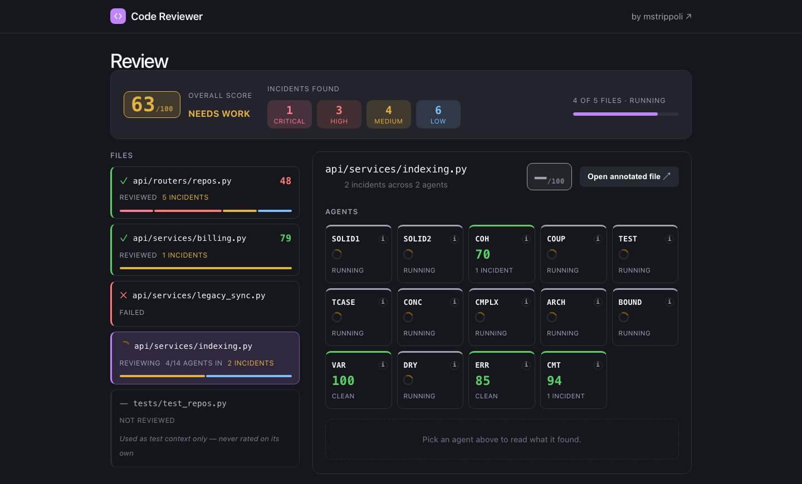
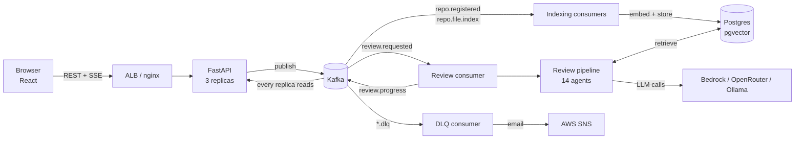

<div align="center">

# Code Reviewer

### An AI code reviewer that grades code on *sustainability*, not style rules

14 specialized AI agents review your Python code in parallel, each judging one design principle.
A retrieval layer lets them compare the code against **your own repository's history**.
The result is one weighted, explainable score per file.

[](#tech-stack)
[](#tech-stack)
[](#tech-stack)
[](#tech-stack)
[](#tech-stack)
[](#tech-stack)
[](#tech-stack)
[](#testing)

**[Live demo from my portfolio →](https://mstrippolidev.com/)**
<br>
<sub>The demo runs on demand to keep cloud costs near zero, so it can take a few minutes to start.</sub>

<br>


<br>
<sub>The review dashboard while a review is running: per-file status, live score, and each of the 14 agents reporting as it finishes. (Rendered from the app's built-in sample data.)</sub>

</div>

---

## Contents

**Part 1 — The short version (for everyone)**
1. [What is this?](#what-is-this)
2. [Why it is different](#why-it-is-different)
3. [Skills and techniques it shows](#skills-and-techniques-it-shows)
4. [Tech stack at a glance](#tech-stack-at-a-glance)
5. [Numbers](#numbers)

**Part 2 — The technical deep dive**
1. [System architecture](#system-architecture)
2. [The review pipeline](#the-review-pipeline)
3. [The 14 agents and the scoring model](#the-14-agents-and-the-scoring-model)
4. [The retrieval (RAG) layer](#the-retrieval-rag-layer)
5. [Duplicate detection (DRY)](#duplicate-detection-dry)
6. [Corrective RAG: finding a file's tests](#corrective-rag-finding-a-files-tests)
7. [Exemplars and the multi-model vote](#exemplars-and-the-multi-model-vote)
8. [The backend: events, queues and live progress](#the-backend-events-queues-and-live-progress)
9. [The frontend](#the-frontend)
10. [Infrastructure and deployment](#infrastructure-and-deployment)
11. [Design decisions and lessons learned](#design-decisions-and-lessons-learned)
12. [Testing](#testing)
13. [Repository layout](#repository-layout)
14. [Running it locally](#running-it-locally)
15. [Tech stack in full](#tech-stack)

---

# Part 1 — The short version

## What is this?

Most code checkers ask *"does this follow the rules?"* (line length, import order, naming style).
Tools like Black and Ruff already do that well.

This project asks a harder question: ***"Will this code be easy to change next year?"***

You give it a Python file or a whole GitHub repository. Fourteen AI reviewers each look at it
through one lens, such as *coupling*, *cohesion*, *testability* or *error handling*. They report
specific problems with the line numbers, why it matters and how to fix it. A final step merges
everything into one weighted score and a recommendation: **approved**, **needs work** or **rejected**.

> Think of it as a panel of 14 senior engineers who each review the same file, then hand
> one combined report to the author.

It is a full product, not a notebook: login with GitHub, register a repository, watch it index
live, pick files, and watch the review arrive agent by agent.

## Why it is different

| Typical AI code review | This project |
|---|---|
| One big prompt: "review this code" | **14 focused agents**, each with one job and its own rubric |
| Sees only the file you paste | Also searches **your repository's history** for duplicates and related files |
| Always sounds confident | Uses **judges that must show their evidence**, and a **3-model vote** before anything is trusted as an example |
| Fixed list of rules | **Judgment against a rubric**: it can report a real problem that no rule list anticipated |
| Runs on a laptop | Runs as an event-driven system on **Kubernetes, Kafka and AWS**, launched on demand for a few cents |

## Skills and techniques it shows

Written in plain language first, with the technical term in bold.

**AI engineering**
- **Multi-agent system.** Fourteen specialists run in parallel instead of one generalist. *(LangChain)*
- **RAG (Retrieval-Augmented Generation).** The AI looks things up in the repository before answering, so it is not guessing. *(LlamaIndex, pgvector)*
- **Corrective RAG (CRAG).** If the first lookup finds nothing useful, the system **rewrites its own search query and tries again**, instead of giving up or making something up.
- **Hybrid search + reranking.** Combines meaning-based search (embeddings) with keyword search (BM25), merges them with **Reciprocal Rank Fusion**, then lets a second model (a **cross-encoder**) re-order the results.
- **Multi-hop retrieval.** An agent that is unsure about a dependency can **fetch the other file and re-read** before deciding, using tool calling.
- **LLM-as-judge with a panel.** Three models from **different companies** must all agree before code is saved as a "good example". One model grading its own family's work is biased, so the panel is built to avoid that.
- **Few-shot exemplars.** Reviewers are shown a short example of good code *from the same repository* to calibrate their judgment.
- **Prompt-injection screening.** Code is untrusted input, so it is checked before any agent sees it. *(Guardrails AI)*
- **Provider-agnostic LLM layer.** The same agents run on local Ollama, OpenRouter, or AWS Bedrock.

**Software and data engineering**
- **Event-driven architecture** on **Kafka** (Strimzi on Kubernetes): topics, consumer groups, dead-letter queues.
- **Real-time UI** with **Server-Sent Events**, including a fix for streaming across several server replicas.
- **Multi-tenant data isolation.** Every stored chunk is scoped by repository and owner, so one user's private code can never surface in another's review.
- **Structural duplicate detection** from the **AST** (code structure), blind to variable names, plus an LLM judge for "same idea, different words" duplicates.
- **Async Python** (FastAPI, SQLAlchemy 2, asyncpg), **Alembic** migrations, **OAuth** login, encrypted tokens at rest.

**Cloud, DevOps and cost engineering**
- **Infrastructure as Code** with **Terraform**; a custom machine image baked with **Packer**.
- **CI/CD** on **GitHub Actions** using **OIDC**, so there are **no AWS keys stored in GitHub**.
- **Kubernetes** (k3s) with operators for Kafka (Strimzi) and Postgres (CloudNativePG), configured with **Kustomize**.
- **Cost-first design.** The live demo costs **a few cents per run and roughly $3–4/month idle**, instead of $100+/month for an always-on cluster.
- **Observability and alerting.** Any message that lands on a dead-letter queue sends an **email through AWS SNS**.

**Engineering practice**
- **770 automated tests** that run in seconds, plus opt-in tests against real models and real AWS.
- Strict style rules (typed code, small functions, dependency inversion), enforced by habit and review.
- Real production bugs found, diagnosed from logs and fixed, written up under [Lessons learned](#design-decisions-and-lessons-learned).

## Tech stack at a glance

| Area | Tools |
|---|---|
| **AI / ML** | LangChain, LlamaIndex, Guardrails AI, sentence-transformers (cross-encoder), BM25 |
| **Models** | DeepSeek (Bedrock), Ollama (local), OpenRouter, Amazon Titan and nomic embeddings |
| **Backend** | Python, FastAPI, SQLAlchemy 2 (async), Pydantic, Alembic, aiokafka |
| **Data** | PostgreSQL with pgvector, Apache Kafka |
| **Frontend** | React 19, Vite, React Router, Server-Sent Events |
| **Infra** | AWS (EC2, ALB, Bedrock, SNS, S3, ECR, ACM, Route 53), Terraform, Packer, k3s, Kustomize |
| **CI/CD** | GitHub Actions with OIDC |
| **Quality** | pytest, fakes for fast tests, real-model tests for prompts |

## Numbers

| | |
|---|---|
| Review agents | **14**, running in parallel per file |
| Automated tests | **770** fast tests (plus opt-in LLM, database, Kafka, Bedrock and SNS suites) |
| Idle cost of the live demo | **roughly $3–4/month** (machine image snapshot and container registry) |
| Cost of one demo run | **about $0.13** for 20 minutes |
| Time from click to ready | **about 7 minutes** (workflow plus boot) |
| Review of a small file | **seconds** on a hosted model (a 14-agent run measured at about 5 s) |

---

# Part 2 — The technical deep dive

## System architecture

Three deployable parts with strict boundaries:

```
code-reviewer/
├── code_reviewer/   mechanism: reviews content, owns the RAG layer
├── api/             policy and lifecycle: auth, ingestion, queues, streaming
└── frontend/        React UI that talks to api/ over HTTP only
```

- **`code_reviewer/` owns mechanism.** Given content it reviews it; given a `repo_id`, `owner_id` and
  file path it indexes or retrieves. It clones nothing, authenticates nobody and schedules nothing.
- **`api/` owns policy and lifecycle.** It decides *when* things happen and *who* may trigger them.
  It calls `code_reviewer` as a Python import and never writes to the vector store itself.
- **Why the split.** The two sides change for different reasons (the rubric versus GitHub and
  deployment topology). Authorization lives in exactly one place, so two definitions of "allowed"
  cannot drift apart.



## The review pipeline

Every file goes through guards that run **cheapest first**, so no model call is spent on input
that was always going to be rejected.

```
submission
  → PR file selection        cap of 15 files; tests are set aside as context, not dropped
  → raw character guard      pure length check, no LLM
  → Guardrails intake screen "is this code?" + prompt-injection scan (concurrent across files)
  → file size validation     normal / soft limit / hard limit
  → 14 agents in parallel    one RunnableParallel fan-out per file
  → aggregator               weighted rating, recommendation, skipped-file report
```

- **Chunking.** Past the soft limit (500 lines), chunk-level agents get one function or class at a
  time, split by AST. Their incident line numbers are offset back to file-absolute positions and the
  rating is recomputed from the merged incidents.
- **Hard limit.** Past 750 lines, the six whole-file agents short-circuit to rating 0 with an
  explanatory incident, without spending a model call. The aggregator then always rejects.
- **Failure isolation.** A failing file or agent never fails the whole job. It is reported as a
  skipped file or a failed agent, and the review still completes.
- **Subset, not rejection.** A pull request over the 15-file cap is reduced to the 15 largest
  source files, and the rest are listed in the report.

## The 14 agents and the scoring model

Agents exercise **judgment against a rubric**, never a closed list of violation types. Every prompt
carries a fallback clause so a genuinely new finding is reported at `low` instead of dropped. A
closed category list was considered and rejected on purpose: the real failure is a *false* claim,
not a claim outside a list, and an enum cannot tell those apart.

| Weight | Agents |
|---|---|
| **2.0** pillars | SOLID1 (SRP + open/closed), SOLID2 (LSP + ISP + DIP), COH (cohesion), COUP (coupling), TEST (testability) |
| **1.5** important | TCASE (test-gap detector), CONC (concurrency), CMPLX (complexity), ARCH (architecture), BOUND (boundaries) |
| **1.0** standard | VAR (naming), DRY (duplication), ERR (error handling) |
| **0.5** low | CMT (comments) |

- **Per-agent rating** starts at 100 and loses points per incident: critical −20, high −15, medium −7, low −3.
- **Rating is computed by the pipeline, not reported by the model.** A middleware recalculates it from
  the incidents, and another resets any `failed` flag the model tries to set on itself.
- **Aggregate** is the weight-averaged mean of the agents' ratings.
- **Recommendation:** `APPROVED` above 85 with no zero-rated agent and no critical incident;
  `NEEDS_WORK` from 60 to 85; `REJECTED` below 60, on any rating of 0, or on any critical incident.
- **Structured output** is a Pydantic schema per agent, with retry middleware for malformed output
  and a separate retry for transient failures (timeouts, rate limits).

## The retrieval (RAG) layer

LlamaIndex owns **all** embedding, chunking, retrieval and reranking. LangChain owns the agents and
**never embeds anything**, so insert-time and query-time vectors cannot silently diverge.

- **Multi-tenant scoping.** Every chunk carries `repo_id` (GitHub's numeric id, stable across renames)
  and `owner_id`. Both are filtered **inside the vector query**, never after fetching, so a wrong
  `repo_id` still cannot leak another owner's private code.
- **Storage key** is `(repo_id, file_path)`. On any update, the file's chunks are deleted and
  re-inserted; there is no separate "update" path. Only merged, known-good state is ever indexed.
- **Hard deletes only.** Disconnecting a repo really purges its vectors. A soft-delete flag would be
  a leak waiting for a filtering bug.
- **Three-stage retrieval:** rewrite the query, vector search over-fetching wide, then rerank. If
  nothing clears the relevance floor, **nothing is injected**: silence beats noise.
- **Embeddings are per-deployment.** Local code embeddings are 3584-dimensional and Titan is
  1024-dimensional, so switching provider means a full re-index.

## Duplicate detection (DRY)

Two passes feed one merged result, always scoped to the submitting repository.

1. **Intra-PR (in memory):** compares the pull request's own files pairwise. Nothing is persisted,
   so unmerged code never pollutes the index.
2. **Cross-history:** searches the repository's indexed corpus with **four recall routes**:
   structural hash, explanation embedding, raw-code embedding and BM25 keywords.

How candidates are judged:

- **Exact clones** (identical AST structure, blind to names and literals) are reported directly from
  the hash. No LLM is needed because the hash already proves it.
- **Fuzzy candidates** are reranked by a **cross-encoder**, then confirmed or dismissed by an
  **LLM judge** that sees both real code fragments and handles *partial* duplicates inside larger functions.
- **Rank, not score.** A measurement showed the same genuine duplicate scoring +8.9 alone and −3.1
  when diluted in a large function, so absolute score floors cannot work. Selection keeps the top-N.
- **Clustering.** A disjoint-set pass merges near-duplicate groups, so six similar handlers report
  once instead of as 18 pairwise incidents. Judge calls also run concurrently (44 s down from 136 s on that fixture).
- **Oversize handling.** Pairs too large for one call are split with overlap, judged piece by piece
  and merged by union. A bounded recursion depth guarantees termination.

## Corrective RAG: finding a file's tests

The TCASE agent must know what a file's existing tests assert, but a pull request often contains only
the source. For registered repositories the system **searches the repo for the matching test file**.

1. **Deterministic bucket:** indexed test files sharing the source's name stem.
2. **Semantic bucket:** dense search fused with BM25 by **Reciprocal Rank Fusion**, because their
   scores are not on comparable scales.
3. **Narrow by symbol:** keep only the chunks that mention the source's own functions and classes
   (verbatim, no summarizing).
4. **Rerank and judge:** a cross-encoder reranks, then a fast-tier LLM returns a categorical verdict
   per candidate: `match`, `no_match` or `ambiguous`. There is **no confidence number**, because a
   model-reported score is not calibrated.
5. **Correct:** if nothing matched, an LLM **rewrites the search query** using the judge's rejection
   reasons, and the search runs one more time. Still nothing means "no test file", handled explicitly.

## Exemplars and the multi-model vote

Reviewers are calibrated with a retrieved example of good code (few-shot, not fine-tuning). Examples
come from the same repository, or a hand-curated corpus for repo-less reviews, never both.

Promotion into the corpus is **gated, never automatic**. A rating of 100 only means "this agent found
nothing wrong", which a one-line getter satisfies, and promoting on that would let the agent grade its own homework.

- A **three-judge panel from disjoint model families** votes yes or no (judges at temperature 0; diversity comes from the models).
- **Unanimous yes** is promoted. Anything else goes to a human-review queue, separate from the dead-letter queue.
- The nominating score is **withheld from the judges**, so they cannot simply agree with the agent.
- The panel runs **off the request path**, as batch work with no latency budget.

## The backend: events, queues and live progress

FastAPI app with async SQLAlchemy and GitHub OAuth. Session tokens are JWTs, and the stored GitHub
token is encrypted at rest with Fernet using a separate key.

**Indexing pipeline (Kafka):**

```
POST /api/repos → repo.registered → fetch tarball + walk
  → repo.file.index (one per .py file, parallel embedding)
  → repo.file.progress / repo.status.progress → SSE to the browser
```

**Review pipeline:** `POST /api/repos/{id}/review` creates a job and publishes `review.requested`.
A consumer runs the 14 agents, persists each file's per-agent results, and streams progress.
Guests can review up to five files with no login or repository, through a signed cookie session.

**Dead-letter queues and alerts.** Failed messages are forwarded to `*.dlq` topics. One consumer
subscribes to all three and sends an **AWS SNS email** naming the topic, partition, offset, key and
error. It never includes the payload, which can hold private code. A review that completes with
failed agents inside it is also dead-lettered, because job status alone cannot tell anyone to look.

**Live progress across replicas.** Each browser holds an SSE connection to *one* pod, while Kafka
gives the review to *whichever* pod owns the partition. Sticky sessions cannot align the two. The
fix is a dedicated `review.progress` topic keyed by review id (events stay ordered), read by **every
pod through its own consumer group**, so each pod relays events to the browsers attached to it.

## The frontend

React 19 with Vite and React Router. A two-pane repository browser with a live file tree, a review
page that fills in per agent as results arrive, and an annotated file view that maps incidents to
line ranges. A guest mode offers curated examples or drag-and-drop upload. nginx serves the build and
proxies `/api/` to the backend with buffering off for SSE.

## Infrastructure and deployment

**Goal:** a 20-minute live demo launched by an anonymous visitor from a portfolio button, with idle
cost near zero and a click ready in minutes. That rules out an always-on cluster.

| Option | Idle cost | Cold start | Verdict |
|---|---|---|---|
| EKS (built and verified, kept as a showcase in `terraform/eks/`) | $110+/month | 16–26 min | Rejected for the demo |
| **Single-node k3s from a baked AMI behind an ALB** | **roughly $3–4/month** | **about 7 min** | **Chosen** |

- **One on-demand EC2 instance** running k3s, created and destroyed together with its ALB. Spot was
  dropped after a reclaim wiped a live demo 8.5 minutes in.
- **Packer-baked AMI** pre-pulls every image and renders the Kafka and Postgres operator bundles
  offline, so boot needs no internet. Boot applies operators, then the app overlay.
- **Terraform** (`terraform/demo`) owns the ALB, ASG, launch template, IAM and DNS per launch.
  `terraform/bootstrap` holds the persistent pieces: ECR, state bucket, ACM certificate and OIDC roles.
- **Kubernetes:** Strimzi (Kafka 4.2, KRaft) and CloudNativePG (Postgres with pgvector), configured
  with Kustomize overlays.
- **Secrets** live in S3 and are read at boot; **Bedrock** serves the models through the instance role.

**CI/CD (GitHub Actions, OIDC only, no stored AWS keys):**

| Workflow | What it does |
|---|---|
| `build-images` | On every merge to `main`: builds the four images, bakes a new AMI, then prunes older AMIs **only after the new one succeeds** |
| `launch-demo` | Applies the Terraform stack; returns in about 4 minutes |
| `destroy-demo` | Tears the stack down; a no-op on empty state |

The trust policy accepts only the `main` branch, using GitHub's immutable repository identifier.

## Design decisions and lessons learned

Getting the demo to run end to end surfaced bugs that only exist on a real cluster. Each is a good
example of a "works on my machine" trap.

| Symptom | Root cause | Fix |
|---|---|---|
| Kafka brokers never started | Operator RBAC bindings still named namespace `myproject`; kustomize moves resources but not binding subjects | Rewrite the subjects at bake time and fail the bake if any remain |
| API crashed on import | A Guardrails Hub validator is not a pip dependency, and the Hub's API host no longer resolves | Install the package straight from the Hub's package index and ship the registry file |
| `PermissionError: logs` | Non-root user could not create a directory under a root-owned `/app` | Create it in the image with the right owner |
| `schema "code_reviewer" does not exist` | Set up by hand locally, never created on a fresh database | Create it in the Postgres bootstrap SQL |
| Review page stuck forever | Progress was broadcast in one process's memory, but 3 replicas split the work | Kafka fan-out topic with one consumer group per pod |
| Login to Postgres failed for RAG only | `str()` on a SQLAlchemy URL masks the password as `***`, and LlamaIndex stringifies it | Pass the URL rendered with the real password; regression test pins it |
| Two agents failed with a recursion error | Their step budget was hand-picked, and adding a middleware hook silently halved it | Derive the budget from the hook count; test against real graph counting |

Choices worth defending:

- **Duplication is cheaper than the wrong abstraction.** The reviewer reflects this: it reports
  partial duplication but will advise leaving a coincidental one alone.
- **Categorical judge verdicts, never self-reported confidence.**
- **Pipeline-owned fields are enforced, not just documented.** Telling a model "do not set this" is
  not enough, so middleware resets it.
- **Failures are isolated and reported**, never swallowed or allowed to take down the whole job.
- **Cheap checks first, expensive checks last**, everywhere.

## Testing

- **770 fast tests** run in about 6 seconds with fakes: splitters, guards, dispatch wiring, schemas,
  Kafka consumers, the SNS notifier, the progress relay.
- **Real-model tests** hit a real LLM, because a mocked model cannot tell you whether a prompt works.
  Prompt correctness is validated against a hosted model, since small local models give false failures.
- **Opt-in markers** keep expensive suites out of the default run: `llm`, `db`, `kafka`, `bedrock`, `sns`.
- **Fixture discipline per agent:** one fixture per violation, a clean fixture, four priority tiers,
  and false-positive traps that test precision, not just recall.
- Regression tests pin the production bugs above, such as the masked database password and the agent step budget.

```bash
poetry run pytest                  # fast suite, no external services
poetry run pytest -m llm           # real-model suites (run sparingly)
poetry run pytest -m sns           # sends one real email through SNS
```

## Repository layout

```
code-reviewer/
├── code_reviewer/        review engine
│   ├── agents/           14 agents, base class, LLM providers and middleware
│   ├── pipeline/         orchestrator, dispatch, aggregator, guards, AST splitter
│   ├── rag/              indexing, retrieval, rerank, DRY, TCASE pairing, exemplars
│   ├── consensus/        multi-model voting
│   ├── guardrails/       intake screen and validators
│   ├── prompts/          one system prompt per agent
│   └── schemas/          Pydantic models
├── api/                  FastAPI app: routers, db models, Alembic, Kafka consumers
├── frontend/             React app
├── k8s/                  Kustomize base and overlays, Strimzi topics
├── terraform/            bootstrap (persistent), demo (per launch), eks (showcase)
├── packer/               AMI recipe and boot script
├── scripts/              runtime secrets upload, AMI pruning
├── .github/workflows/    build-images, launch-demo, destroy-demo
└── tests/                fast suites plus opt-in real-service suites
```

## Running it locally

Prerequisites: Python 3.10+ (the container images use 3.12), [Poetry](https://python-poetry.org/), Node.js, PostgreSQL with the
`pgvector` extension, a Kafka broker, and one LLM backend (Ollama, OpenRouter or AWS Bedrock).

```bash
# 1. Configure
cp .env.example .env              # fill in database, Kafka, GitHub OAuth and model settings

# 2. Backend
poetry install
poetry run alembic upgrade head
poetry run uvicorn api.main:app --reload

# 3. Frontend
cd frontend && npm install && npm run dev
```

Notes:
- Create the `review.progress` topic and the other topics from `k8s/base/kafka/topics/` on your local broker.
- The `code_reviewer` Postgres schema must exist, as the Kubernetes bootstrap SQL creates it in the deployed setup.
- A GitHub OAuth App holds one callback URL, so keep a separate app for local development and for the demo.

## Tech stack

| Layer | Technology |
|---|---|
| Agent orchestration | LangChain (`create_agent`, middleware, structured output, parallel dispatch) |
| Retrieval | LlamaIndex (indexing, hybrid retrieval, reranking), pgvector, BM25, sentence-transformers cross-encoder |
| Safety | Guardrails AI (intake screening only) |
| LLM providers | Ollama (local), OpenRouter, AWS Bedrock (DeepSeek) |
| Embeddings | nomic-embed-text and nomic-embed-code (local), Amazon Titan v2 (cloud) |
| API | FastAPI, Pydantic v2, SQLAlchemy 2 async, asyncpg, Alembic, httpx (HTTP/2), PyJWT, cryptography |
| Messaging | Apache Kafka (Strimzi, KRaft), aiokafka, dead-letter queues, AWS SNS |
| Database | PostgreSQL 16 with pgvector, CloudNativePG operator |
| Frontend | React 19, Vite, React Router, Server-Sent Events, nginx |
| Compute | k3s on EC2 (on-demand), Application Load Balancer, Route 53, ACM |
| IaC and images | Terraform, Packer, Kustomize, Docker (multi-stage, BuildKit secrets) |
| CI/CD | GitHub Actions with OIDC federation |
| Testing | pytest with fakes, real-model and real-service opt-in suites |

---

<div align="center">

Built by **Miquel Strippoli**. A learning-first project that deliberately uses real production patterns.

</div>
